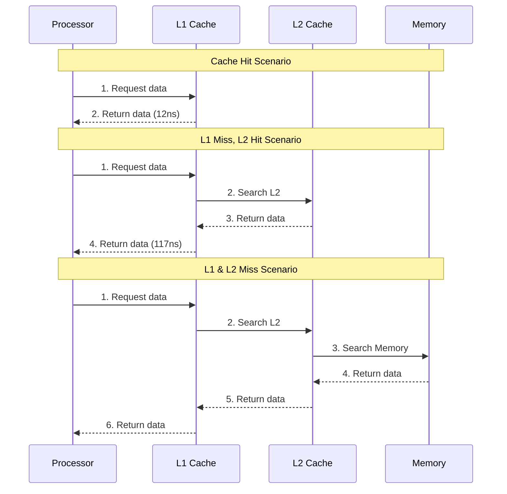
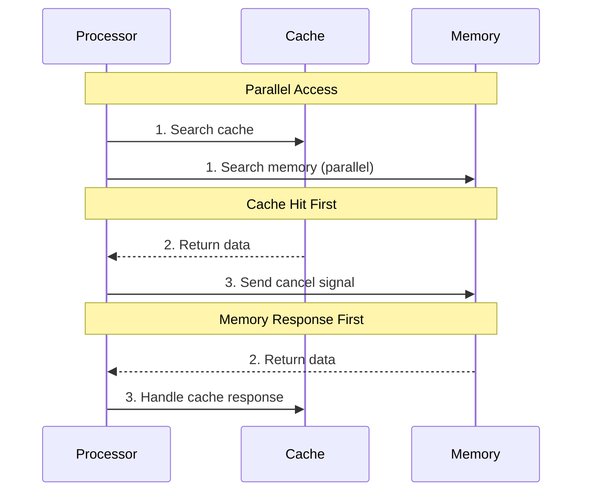

## Definitions

**Look-Through Policy**: Processor searches cache first → if miss, cache searches next level/memory → returns data through cache hierarchy

**Look-Aside Policy**: Processor simultaneously searches both cache and memory → requires cancel signals when found in cache

## Key Differences

|Aspect|Look-Through|Look-Aside|
|---|---|---|
|**Search Strategy**|Sequential through hierarchy|Parallel cache + memory|
|**Control Logic**|Simple, hierarchical|Complex signaling|
|**Signal Overhead**|Minimal|High (cancel signals)|
|**Usage**|Standard (95%+ hit rates)|Rarely used|
|**Bandwidth**|Efficient filtering|Wastes memory bandwidth|

## Look-Through Cache

## Look-Aside Cache

## Why Look-Through Dominates

- **High Hit Rates**: Modern caches achieve 95%+ hit rates
- **Bandwidth Efficiency**: Inner caches filter requests to outer levels
- **Simpler Design**: No complex signaling required
- **Better Performance**: Avoids unnecessary memory accesses

## Application-Level Caching

For software caches, the distinction is different:

- **Look-Aside**: Application manages cache consistency and data insertion
- **Look-Through**: Cache transparently handles consistency without application involvement